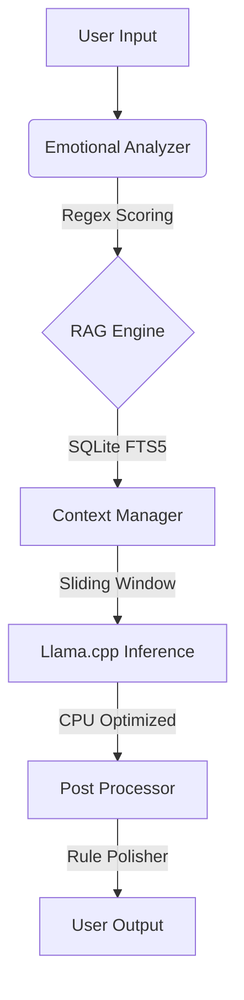

<div align="center">

# NEURO-LITE ECOSYSTEM
**The Speculative Empathic Engine**

[](https://www.python.org/)
[](https://ubuntu.com/)
[](LICENSE)
[]()

*An illusion of intelligence designed for extreme hardware constraints.*

[Features](#-key-features) • [Installation](#-installation) • [Usage](#-usage) • [Architecture](#-architecture)

</div>


## 📜 Overview

**NEURO-LITE ECOSYSTEM** is a production-grade, conversational AI system architected specifically for low-resource environments. It is designed to run entirely on an **Intel i3 CPU with 4GB RAM** without GPU acceleration.

### The Philosophy: "Illusion of Intelligence"
Instead of relying on massive model parameters, this system achieves a "fast, professional, and empathetic" feel through:
1.  **Single Pass Inference:** No chain-of-thought or multi-step reasoning. One inference call only.
2.  **Rule-Based Polishing:** Python logic modifies tone and formatting in < 2ms post-inference.
3.  **Micro-RAG:** SQLite FTS5 for deterministic, sub-10ms knowledge retrieval (no vector DBs).

---

## ✨ Key Features

-   **Ultra-Lightweight:** Optimized for 4GB RAM and Dual-Core CPUs.
-   **Low Latency Perception:** Emotional analysis and RAG retrieval happen almost instantly before inference.
-   **Zero-Trust Data Ingestion:** Developer tools to strip PII and toxic content from training data.
-   **Self-Healing Service:** Systemd service with auto-restart and graceful shutdown.
-   **Complete Pipeline:** Includes OS tuning, dependency setup, model downloading, and service deployment.

---

## 🛠️ Prerequisites

Before installing, ensure you have:
-   **OS:** Ubuntu 22.04 LTS (Clean install recommended).
-   **Hardware:** 
    -   Intel i3 (or equivalent).
    -   4GB RAM.
    -   ~5GB Disk Space (for OS, Swap, and Model).
-   **Privileges:** `sudo` root access.

---

## 🚀 Installation

Follow these steps to install the full ecosystem on your server.

### 1. Clone the Repository
Clone the project into the `/opt` directory for system-wide access.

```bash
sudo git clone https://github.com/boybarley/NEURO-LITE-ECOSYSTEM.git /opt/neuro-lite
cd /opt/neuro-lite
```

### 2. Make Installer Executable
Grant execution permissions to the main installer script.

```bash
sudo chmod +x install.sh
```

### 3. Run the Installer
Execute the installer script. This process is **idempotent** (safe to run multiple times) and fully automated. It will:
1.  Tune OS parameters (Swappiness, CPU Governor).
2.  Create a 2GB swap file if missing.
3.  Install Python dependencies.
4.  Download the `Qwen2.5-3B-Instruct-Q4_K_M.gguf` model.
5.  Setup the systemd service.

```bash
sudo ./install.sh
```

*Note: The model download is approx 2GB. Please wait for the process to complete.*

---

## 💻 Usage

### Accessing the Web Interface
Once the installation completes, the service starts automatically.

1.  Open your web browser.
2.  Navigate to:
    ```
    http://<YOUR_SERVER_IP>:8000
    ```
    *(If running locally, use `http://localhost:8000`)*

### Managing the Service
You can control the background service using standard `systemctl` commands:

**Check Status:**
```bash
sudo systemctl status neuro-lite
```

**Stop the Service:**
```bash
sudo systemctl stop neuro-lite
```

**Restart the Service:**
```bash
sudo systemctl restart neuro-lite
```

**View Logs:**
```bash
journalctl -u neuro-lite -f
```

---

## 🏗️ Architecture

The system prioritizes speed over reasoning complexity using a linear pipeline.



### Component Specs
| Component | Technology | Constraint |
| :--- | :--- | :--- |
| **LLM** | Llama.cpp (Qwen 2.5 3B) | Single Pass, No GPU |
| **RAG** | SQLite FTS5 | Sub-10ms retrieval |
| **Emotion** | Regex + Heuristics | < 1ms execution |
| **Memory** | Sliding Window + Heuristic Bridge | Prevents context overflow |

---

## 🛠️ Developer Tools

Located in the `developer_tools/` directory for pre-release data preparation.

1.  **`distill_knowledge.py`**: Generates SOP Q&A from a Premium AI API and stores it in SQLite.
2.  **`validate_data.py`**: Scans crowdsourced data for PII, toxicity, and duplicates (Zero Trust).
3.  **`build_release.py`**: Packages the system into a deployable `tar.gz` artifact.

---

## 📁 Project Structure

```text
NEURO-LITE-ECOSYSTEM/
├── install.sh              # Main entry point for installation
├── config.env              # Configuration variables
├── modules/                # Installation scripts
│   ├── 01_os_tuning.sh
│   ├── 02_install_deps.sh
│   ├── 03_download_model.sh
│   └── 04_setup_service.sh
├── core/                   # Application logic
│   ├── main_server.py      # FastAPI entry point
│   ├── rag_engine.py       # Retrieval logic
│   ├── emotional_state.py  # Sentiment analysis
│   └── ...
├── webui/                  # Frontend assets
└── developer_tools/        # Factory side scripts
```

---

## 📝 License

This project is licensed under the MIT License - see the [LICENSE](LICENSE) file for details.

---

<div align="center">
Made with ☕ and engineering pragmatism by <a href="https://boybarley.com">boybarley</a>.
</div>


Masalah

jika tidak bisa download model

Proses upload harus dibagi menjadi 2 tahap: Kirim dari Mac -> Terima di Server.

Ikuti langkah ini tepat:

Langkah 1: Di Mac Anda (Kirim File)
Buka Terminal baru di Mac Anda (bukan di server). Jalankan perintah ini untuk mengirim file dari Desktop Mac ke Server:

bash

scp ~/Desktop/qwen2.5-3b-instruct-q4_k_m.gguf boybarley@192.168.1.66:~
(Masukkan password boybarley jika diminta). Tunggu hingga proses transfer 100% selesai).

Langkah 2: Di Server (Pindahkan File)
Setelah upload selesai, kembali ke terminal Server (yang menampilkan root@ai-server atau boybarley@...). Jalankan perintah ini untuk memindahkan file yang sudah terkirim tadi ke folder instalasi:

bash

# Pindahkan file dari home user ke folder model (butuh sudo)
sudo mv ~/qwen2.5-3b-instruct-q4_k_m.gguf /opt/neuro-lite/models/

# Pastikan konfigurasi sudah benar
sudo tee /opt/neuro-lite/config.env > /dev/null << 'EOF'
PROJECT_DIR="/opt/neuro-lite"
MODEL_FILENAME="qwen2.5-3b-instruct-q4_k_m.gguf"
MODEL_URL="https://huggingface.co/Qwen/Qwen2.5-3B-Instruct-GGUF/resolve/main/qwen2.5-3b-instruct-q4_k_m.gguf"
SWAP_SIZE="2G"
DB_PATH="/opt/neuro-lite/data/knowledge.db"
EOF

# Jalankan instalasi lagi (akan skip download karena file sudah ada)
sudo ./install.sh
Ringkasan:

scp di Mac: Mengirim file.
mv di Server: Memindahkan file ke tempat yang benar.

1. Start Service
Jalankan perintah ini di server untuk memulai AI:

bash

sudo systemctl start neuro-lite
2. Cek Status Service
Pastikan service berjalan tanpa error:

bash

sudo systemctl status neuro-lite
(Harus terlihat status: active (running)).

3. Akses Aplikasi
Buka browser di komputer/Mac Anda dan akses alamat IP server tersebut:

👉 http://192.168.1.66:8000

Anda akan melihat tampilan WebUI Neuro-Lite dan bisa mulai berinteraksi dengan AI.


